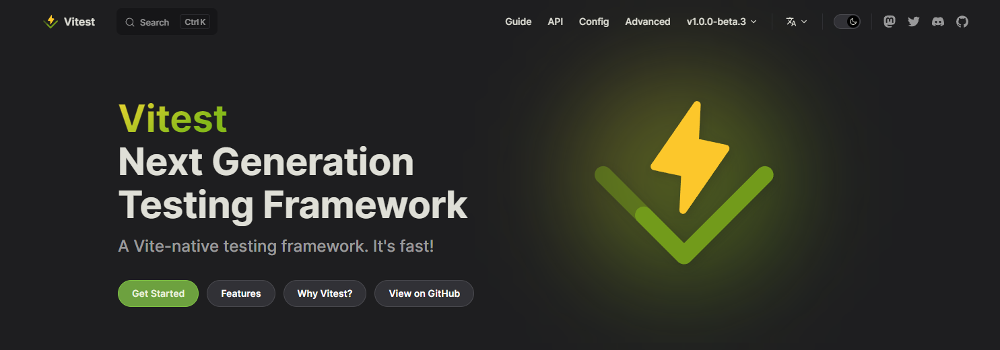

# Frontend

```shell
# 1. Install deps
npm install

# 2. Run project
npm run dev
```


# Backend

```shell
# 1. Install deps
npm install

# 2. Run project
npm run start
```

### Comments

- Missed opportunities: It would have been nice to have worked on the backend project in a TDD fashion. I would have opted to use [Vitest](https://vitest.dev/). I chose not to for the sake of time and simplicity.


